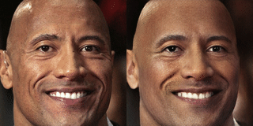

# CONFIG: Controllable Neural Face Image Generation


This is a reference implementation of [CONFIG: Controllable Neural Face Image Generation](https://arxiv.org/abs/2005.02671) published at ECCV 2020. ConfigNet is a neural face model that allows for controlling individual aspects of output images in semantically meaningful ways. ConfigNet is trained on real face images as well as synthetic face renders. It uses synthetic data to factorize the latent space into elements that correspond to the inputs of a traditional rendering pipeline, separating aspects such as head pose, facial expression, hair style, illumination, and many others which are very hard to annotate in real data. The real images, which are presented to the network without labels, extend the variety of the generated images and encourage realism.

## Getting started
To start working with ConfigNet you will need to take the following steps:
 - Install Python >= 3.6
 - Install Python packages using `pip install -r setup/requirements.txt`
 - If you are on Windows download and setup OpenFace automatically by running `python setup/download_deps.py`. If you are on other systems you will need to install OpenFace according to [the instructions](https://github.com/TadasBaltrusaitis/OpenFace/wiki), you will also need to set path to OpenFace in `confignet/face_image_normalizer.py`.
 - Download the model.zip file containing the pre-trained models from the release section of the repository and extract it in the root directory of the repo. Keep in mind that the models have additional license constraints as described below.

At this point you should be ready to go. To see how ConfigNet works please try the demo, which is described below. You can also reproduce the controllability metrics reported in the paper as described further down. If you want to explore more scenarios, please take a look at the `tests` directory, which demonstrates a lot of the scripts used in this repo.

## Running the demo app
The demo app allows for modifying existing images using ConfigNet, as shown in the video above, as well as sampling novel images and modifying them.
The app can be started in several ways:
 - `python evaluation/confignet_demo.py --image_path <path_to_directory_with_images>` - all the images in the directory will be aligned and up to 200 will be read.
 - `python evaluation/confignet_demo.py --image_path <path_to_single_image>` - the specified image will be loaded, this option permits the use of one-shot learning.
 - `python evaluation/confignet_demo.py` - when no path is specified, the latent codes that generate the output images will be sampled using the LatentGAN.

The demo can be controlled using the keyboard, when the window showing the output images is in focus. The instructions will be displayed in the console window.

### One-shot learning


ConfigNet allows for fine-tuning the generator on the input image, in order to better preserve the persons's identity in the output images.
This can be done by supplying only a single image to the demo app and then pressing B to initiate fine-tuning. Once the process is complete, the output image can be driven with the same set of commands as before.

## Reproducing experiment results
Take the following steps to reproduce the controllability metrics reported in the paper:
 - Download the FFHQ dataset from its [GitHub page](https://github.com/NVlabs/ffhq-dataset), make sure it's the 1024x1024 version.
 - Copy the validation images into a separate directory. The validation images are the ones with numbers >= 60000.
 - Generate a dataset file using the following command in the repo root directory. `python generate_dataset.py --dataset_dir <path_to_validation_set> --dataset_name ffhq_valid --output_dir <path_to_directory_where_dataset_will_be_stored> --pre_normalize 0`
 - Compute the controllability metrics by running the following, this may take a while. `python evaluation/evaluate_confignet_controllability.py --test_set_path <path_to_dataset_file> --output_dir <directory_of_your_choice>`
 - Once the script is completed you should see a .json file in the output directory. The first three values of the `contr_attribute_means` field should correspond to the values seen in the first row of Table 2 of the paper.

## 3rd Party Libraries
Our ConfigNet implementation uses [OpenFace](https://github.com/TadasBaltrusaitis/OpenFace) to detect facial landmarks that are required to align the face images. When using our code and pre-trained models make sure to follow the constraints of the OpenFace license as well as [the licences of the datasets used in its training](https://github.com/TadasBaltrusaitis/OpenFace/wiki/Datasets).

The pre-trained models were trained using data from the [FFHQ dataset](https://github.com/NVlabs/ffhq-dataset) and their use is thus constrained by the licence of FFHQ.
The face images in the top figure in this readme also come from the FFHQ dataset.

## Citation
If you use our code, models or method in your research, please cite our paper as follows.
```
@inproceedings{KowalskiECCV2020,
    author = {Kowalski, Marek and Garbin, Stephan J. and Estellers, Virginia and Baltrušaitis, Tadas and Johnson, Matthew and Shotton, Jamie},
    title = {CONFIG: Controllable Neural Face Image Generation},
    booktitle = {European Conference on Computer Vision (ECCV)},
    year = {2020}
}
```

## Code of conduct
This project has adopted the [Microsoft Open Source Code of Conduct](https://opensource.microsoft.com/codeofconduct/).

## Trademarks
This project may contain trademarks or logos for projects, products, or services. Authorized use of Microsoft trademarks or logos is subject to and must follow Microsoft's Trademark & Brand Guidelines. Use of Microsoft trademarks or logos in modified versions of this project must not cause confusion or imply Microsoft sponsorship. Any use of third-party trademarks or logos are subject to those third-party's policies.
